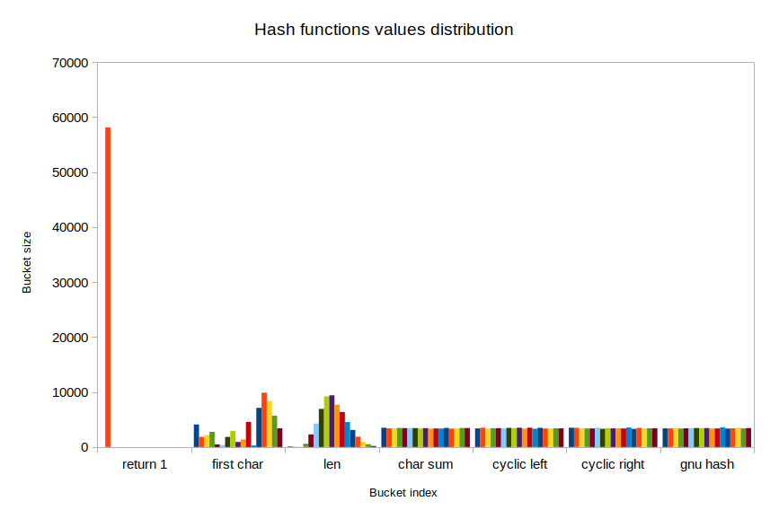
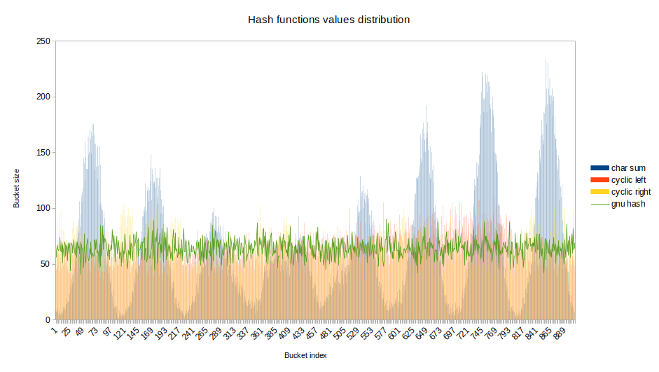

# Hash Table


## Часть 0. Как исследовать самому


- Скомпилируйте программу с помощью

```sh
make
```

- Запустите, передав в качестве аргумента путь к текстовому файлу, содержащему слова для занесения в таблицу

```sh
./run.exe [filepath]
```

Программа создаст файл result.csv, который можно открыть в любом редакторе электронных таблиц **(Разделительный символ, использующийся в csv файле зависит от вашего редактора электронных таблиц, поэтому файл может открыться некорректно)**


## Часть 1. Сравнение хеш-функций


### Введение


*Хеш-функция* - функция, которая принимает на вход данные (последовательность байт) и возвращает целочисленное значение, основанное на этих данных. Поскольку любой целочисленный тип данных ограничен, то иногда на разные данные функция будет возвращать одинаковые значения (это называется *коллизией*). Чем эффективней хеш-функция, тем меньше у нее случается коллизий.

*Хеш-таблица* - ассоциативный массив, который работает по принципу словаря. В роли словаря у нас массив внутри таблицы, вместо первой буквы - значение хеш-функции, а в роли списка слов, начинающихся на эту букву, выступает связный список, который содержит данные, на которых значения хеш-функции совпали. Таким образом, чтобы найти в хеш-таблице элемент достаточно подсчитать значение хеш-функции на ключе и линейно найти его в соотвествующем списке.


### Цель


Сравнить 7 различных хеш-функций, используя хеш-таблицу, и выяснить, какая из них является наиболее эффективной.


### Ход работы


Хеш-таблица является хорошим способом проверить, насколько равномерно хеш-функции распределяют свои значения.

**Исследование проводилось на ключах типа const char[] и значениях типа int.**

Исследуемые хеш-функции:
- "return 1" - Как следует из названия эта функция всегда возвращает единицу
- "first char" - Возвращает первый символ строки
- "len" - Возвращает длину строки
- "char sum" - Суммирует все символы строки
- "cyclic left" - На пустую строку возвращает единицу, иначе складывает текущий символ с текущей суммой циклически сдвинутой влево
- "cyclic right" - На пустую строку возвращает единицу, иначе складывает текущий символ с текущей суммой циклически сдвинутой вправо
- "gnu hash" - Суммирование с домножением предыдущего результата на 33

**Размер таблицы был взят равным 17. Такой маленький размер является крайне неэффективным и неприемлем в практической реализации, однако позволит нагляднее продемонстрировать разницу в распрелении значений хеш-функций.**

- Занесем в хеш-таблицу слова из файла словаря размером около 58000 слов.
- Подсчитаем длины цепочек внутри таблицы, соответствующих значению хеш-функции.
- Повторим для каждой хеш-функции.
- Сравним насколько равномерно распределены эти длины для каждой функции.


### Результат


График 1 иллюстрирует распределение значений 7 хеш-функций на 58000 уникальных значениях ключей. Различные значения показаны различными цветами. Чем эффективней хеш-функция, тем ближе высота каждого из столбцов к среднеарифметическому значению. Как видно, "char sum", "cyclic left", "cyclic right", "gnu hash" дают наиболее равномерное распределение. На графике 2 они сравниваются детально. Для сравнения размер таблицы был увеличен до 907. Как видно, наиболее эффективны "cyclic right", "cyclic left" и "gnu hash". Чтобы сравнить их, подсчитаем среднеквадратичное отклонение по формуле $\sqrt{(bucketsize_1 - averagebucketsize) ^ 2 + ...}$.

|                            |
|:---------------------------------------------------------|
|График 1. Результаты распределения значений хеш-функций   |

|                 |
|:------------------------------------------------|
|График 2. Детальное сравнение лучших хеш-функций |

Как видно из следующих расчетов среднеквадратичного отклонения, значения "gnu hash" наиболее близки к среднеарифметическому, что делает ее хеш-функцией с наилучшим распределением.

|              | Среднеквадратичное отклонение |
| ------------ | ----------------------------- |
| Cyclic right | 14.31                         |
| Cyclic left  | 13.52                         |
| GNU hash     | 8.01                          |


### Вывод


"gnu hash" является хеш-функцией с наиболее равномерно распределенными значениями по сравнению с остальными рассматриваемыми функциями.
