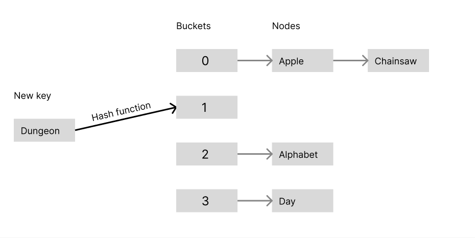
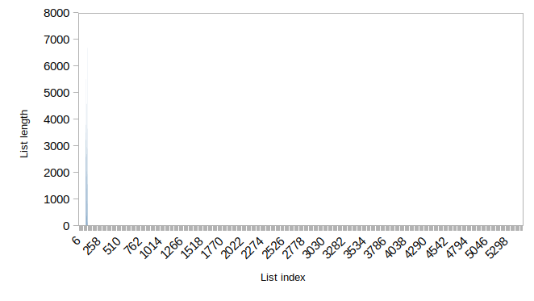
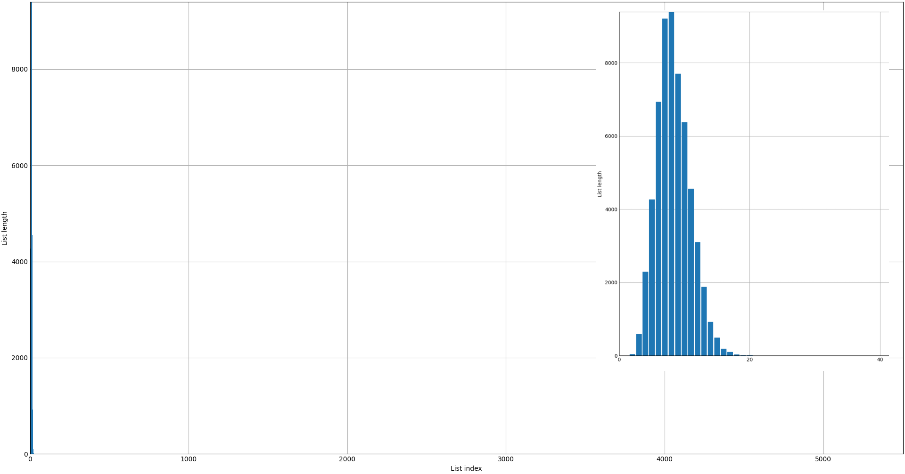
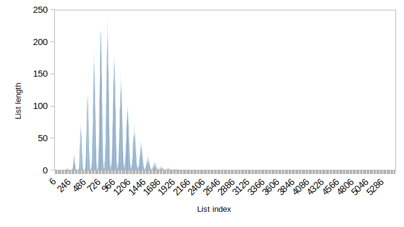
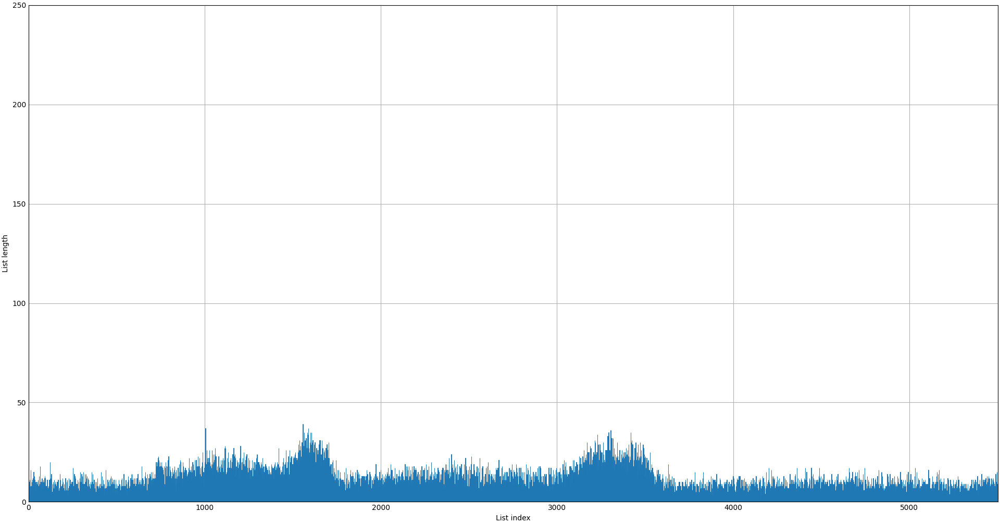
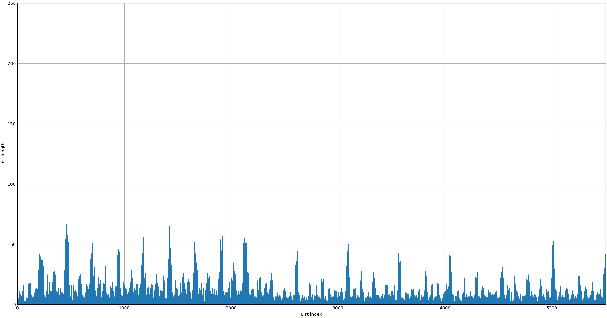
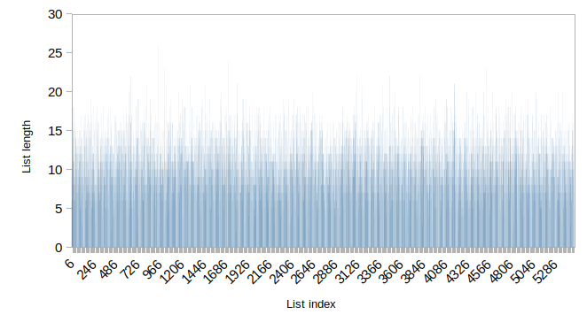

# Hash Table


## Часть 1. Сравнение хеш-функций


### Введение


*Хеш-функция* - функция, которая принимает на вход данные (последовательность байт) и возвращает целочисленное значение, основанное на этих данных. Поскольку любой целочисленный тип данных ограничен, то иногда на разные данные функция будет возвращать одинаковые значения (это называется *коллизией*). Чем эффективней хеш-функция, тем меньше у нее случается коллизий.

*Хеш-таблица* - ассоциативный массив, хранящий ключ и значение и осуществляющий поиск по значению хеш-функции от ключа. Так как при работе хеш-функции неизбежно возникают коллизии, то применяются два способа их разрешения: открытая адресация и метод цепочек. В данном случае мы будем рассматривать метод цепочек. Хеш-таблица представляет из себя массив связных списков. При коллизии пара добавляется в список, номер которого равен значению хеш-функции (по модулю количества списков). Поэтому при поиске элемента по ключу достаточно подсчитать значение хеш-функции и линейно пройтись по соотвествующему списку. Чтобы не замедлять линейный поиск, хеш-таблица поддерживает длину списка не более 2-3 элементов, за счет динамического изменения размера (*rehash*). Однако рехеширование - крайне медленная функция, которая должна вызываться как можно реже, поэтому необходимо подбирать правильный начальный размер таблицы.




### Цель


Сравнить 7 различных хеш-функций, используя хеш-таблицу, и выяснить, какая из них является наиболее эффективной.


### Ход работы


Проверять равномерность распределения значений хеш-функций будем с помощью хеш-таблицы.

**Исследование проводилось на ключах типа const char[] и значениях типа int. Файл содержал около 58000 уникальных слов. Размер таблицы фиксирован и равен 5503. Средний размер списка составляет 11 элементов.**

Исследуемые хеш-функции:
- "return 1" - Как следует из названия эта функция всегда возвращает единицу
- "first char" - Возвращает первый символ строки
- "length" - Возвращает длину строки
- "char sum" - Суммирует все символы строки
- "cyclic left" - Складывает текущий символ с текущей суммой, циклически сдвинутой влево, пока строка не кончится
- "cyclic right" - Складывает текущий символ с текущей суммой, циклически сдвинутой вправо, пока строка не кончится
- "gnu hash" - Складывает текущий символ с текущей суммой, умноженной на 33, пока строка не кончится

Порядок действий:
- Занесем в хеш-таблицу слова из файла словаря размером около 58000 слов.
- Подсчитаем длины цепочек внутри таблицы, соответствующих значению хеш-функции.
- Повторим для каждой хеш-функции.
- Сравним насколько равномерно распределены эти длины для каждой функции.


### Результат

График "return 1" был опущен, так как значения хеш-функции на всех данных равны. Следовательно список один и его длина равна количеству вводимых слов.

|    |
|:-------------------------------------- |
|Рисунок 1 Распределение "first char"    |

|       |
|:--------------------------------- |
|Рисунок 2. Распределение "length"  |

|     |
|:----------------------------------- |
|Рисунок 3. Распределение "char sum"  |

Объясним распределение четырех худших функций:
- "return 1" - Таблица вырождается в связный список
- "first char" - Эта функция имеет всего 52 возможных значения, что существенно меньше размера таблицы. Это стало причиной большой длины списков
- "length" - Поскольку все слова в файле не превосходят по длине 32, то возможные значения этой функции также ограничены
- "char sum" - Значения функции ограничены 32 * 122, где *122* - ASCII код буквы 'z'. Таким образом при больших размерах таблицы эта функция становится неэффективной 

|  |
|:-------------------------------------- |
|Рисунок 4. Распределение "cyclic left"  |

|  |
|:---------------------------------------- |
|Рисунок 5. Распределение "cyclic right"   |

|    |
|:---------------------------------- |
|Рисунок 6. Распределение "gnu hash" |

Функции "cyclic left", "cyclic right", "gnu hash" показали себя как наиболее эффективные: их значения растут достаточно быстро и ограничены только размером типа uint64. Подсчитаем их среднеквадратичное отклонение по формуле $\sqrt{(bucketsize_i - averagebucketsize) ^ 2 + ...}$. Как видно из расчетов, "gnu hash" наименьшее отклонение, что делает ее хеш-функцией с наилучшим распределением.

|              | Среднеквадратичное отклонение |
| ------------ | ----------------------------- |
| Cyclic right | 10.06                         |
| Cyclic left  | 5.73                          |
| GNU hash     | 3.24                          |


#### Анализ работы компилятора


Стоит отметить одну особенность в реализации хеш-функции, основанных на циклическом сдвиге. Рассмотрим код функции "cyclic left". Для анализа воспользуемся сайтом *godbolt.org*. 

```C
hash_t hash_rol(okey_t *key) {
    hash_t sum = 0;

    for (const char *str = *key; *str; str++)
        sum = ((sum << 1) | (sum >> (sizeof(hash_t) * 8 - 1))) + *str;

    return (sum) ? sum : 1;
}
```

При компиляции с флагом -O3, компилятор распознал и заменил операцию циклического сдвига одной аппаратно поддерживаемой командой *rol*, что существенно ускоряет вычисление хеша.

```Assembly
hash_rol:
    mov     rcx, QWORD PTR [rdi]
    movsx   rdx, BYTE PTR [rcx]
    test    dl, dl
    je      .L34
    xor     eax, eax
.L33:
    rol     rax
    add     rcx, 1
    add     rax, rdx
    movsx   rdx, BYTE PTR [rcx]
    test    dl, dl
    jne     .L33
    test    rax, rax
    mov     edx, 1
    cmove   rax, rdx
    ret
.L34:
    mov     eax, 1
    ret
```


### Вывод


"gnu hash" является хеш-функцией с наиболее равномерно распределенными значениями по сравнению с остальными рассматриваемыми функциями. Однако функции "cyclic right" и "cyclic left" могут быть ускорены компилятором с помощью аппаратной поддержки операции циклического сдвига. Поэтому в ситуациях, где требуется скорость, они могут быть предпочтительнее.
