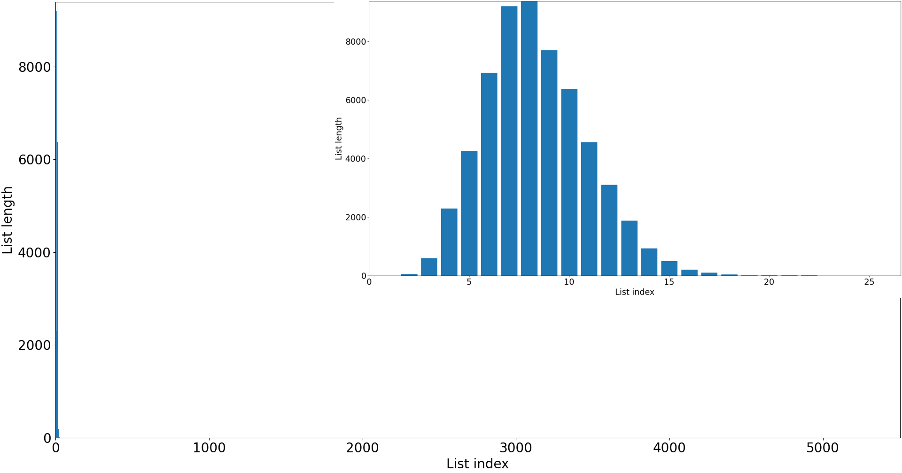
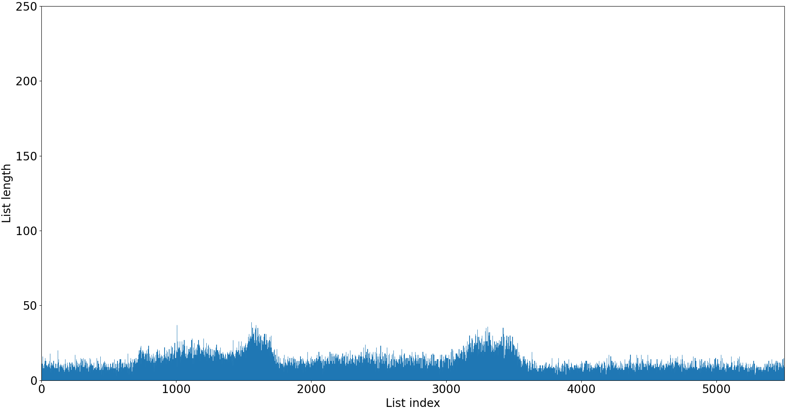
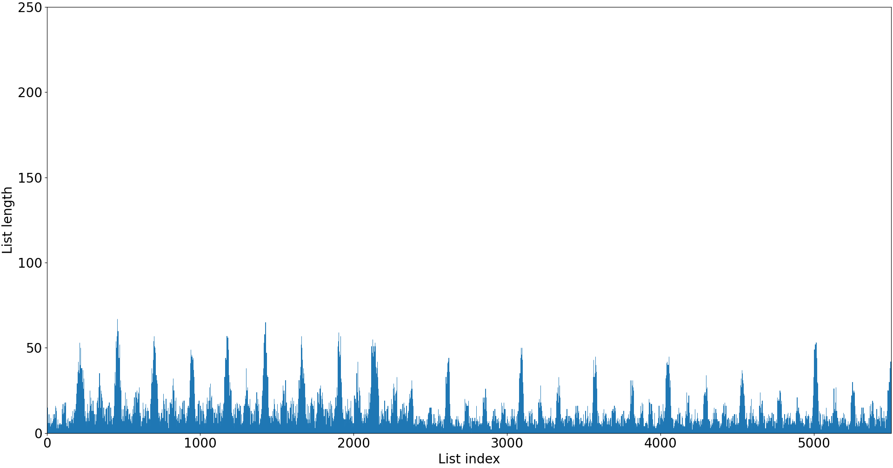
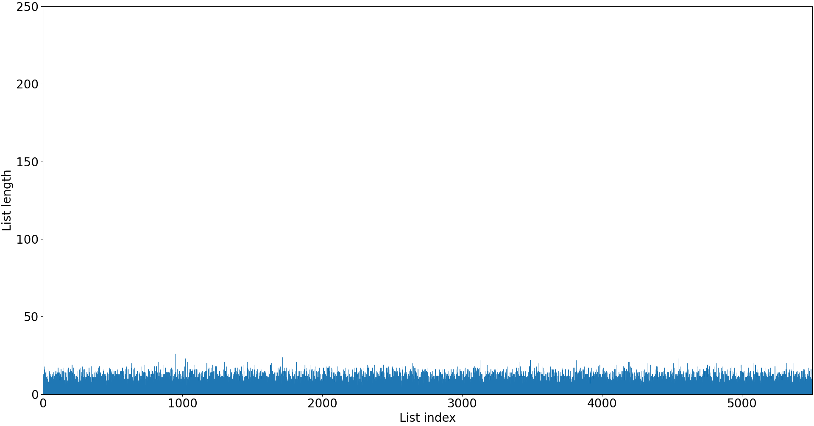
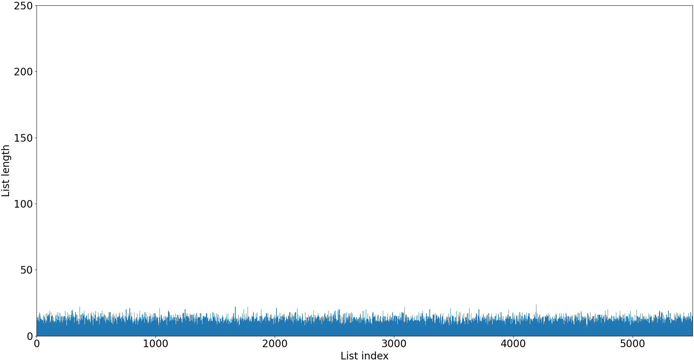

# Hash Table


## Часть 1. Сравнение хеш-функций


### Введение


*Хеш-функция* - функция, которая принимает на вход данные (последовательность байт) и возвращает целочисленное значение, основанное на этих данных. Поскольку любой целочисленный тип данных ограничен, то иногда на разные данные функция будет возвращать одинаковые значения (это называется *коллизией*). Чем эффективней хеш-функция, тем меньше у нее случается коллизий.

*Хеш-таблица* - ассоциативный массив, хранящий ключ и значение и осуществляющий поиск по значению хеш-функции от ключа. Так как при работе хеш-функции неизбежно возникают коллизии, то применяются два способа их разрешения: открытая адресация и метод цепочек. В данном случае мы будем рассматривать метод цепочек. Хеш-таблица представляет из себя массив связных списков. При коллизии пара добавляется в список, номер которого равен значению хеш-функции (по модулю количества списков). Поэтому при поиске элемента по ключу достаточно подсчитать значение хеш-функции и линейно пройтись по соотвествующему списку. Чтобы не замедлять линейный поиск, хеш-таблица поддерживает длину списка не более 2-3 элементов, за счет динамического изменения размера (*rehash*). Однако рехеширование - крайне медленная функция, которая должна вызываться как можно реже, поэтому необходимо подбирать правильный начальный размер таблицы.


### Цель


Сравнить 7 различных хеш-функций, используя хеш-таблицу, и выяснить, какая из них является наиболее эффективной.


### Ход работы


Проверять равномерность распределения значений хеш-функций будем с помощью хеш-таблицы.

**Исследование проводилось на ключах типа const char[] и значениях типа int. Файл содержал около 58000 уникальных слов. Размер таблицы фиксирован и равен 5503. Средний размер списка составляет 11 элементов.**

Исследуемые хеш-функции:
- "return 1" - Как следует из названия эта функция всегда возвращает единицу
- "first char" - Возвращает первый символ строки
- "length" - Возвращает длину строки
- "char sum" - Суммирует все символы строки
- "cyclic left" - Складывает текущий символ с текущей суммой, циклически сдвинутой влево, пока строка не кончится
- "cyclic right" - Складывает текущий символ с текущей суммой, циклически сдвинутой вправо, пока строка не кончится
- "gnu hash" - Складывает текущий символ с текущей суммой, умноженной на 33, пока строка не кончится

Порядок действий:
- Занесем в хеш-таблицу слова из файла словаря размером около 58000 слов.
- Подсчитаем длины цепочек внутри таблицы, соответствующих значению хеш-функции.
- Повторим для каждой хеш-функции.
- Сравним насколько равномерно распределены эти длины для каждой функции.


### Результат

График "return 1" был опущен, так как значения хеш-функции на всех данных равны. Следовательно список один и его длина равна количеству вводимых слов.

|    |
|:-------------------------------------- |
|Рисунок 1 Распределение "first char"    |

|       |
|:--------------------------------- |
|Рисунок 2. Распределение "length"  |

|     |
|:----------------------------------- |
|Рисунок 3. Распределение "char sum"  |

Объясним распределение четырех худших функций:
- "return 1" - Таблица вырождается в связный список
- "first char" - Эта функция имеет всего 52 возможных значения, что существенно меньше размера таблицы. Это стало причиной большой длины списков
- "length" - Поскольку все слова в файле не превосходят по длине 32, то возможные значения этой функции также ограничены
- "char sum" - Значения функции ограничены 32 * 122, где *122* - ASCII код буквы 'z'. Таким образом при больших размерах таблицы эта функция становится неэффективной 

|  |
|:-------------------------------------- |
|Рисунок 4. Распределение "cyclic left"  |

|  |
|:---------------------------------------- |
|Рисунок 5. Распределение "cyclic right"   |

|    |
|:---------------------------------- |
|Рисунок 6. Распределение "gnu hash" |

Функции "cyclic left", "cyclic right", "gnu hash" показали себя как наиболее эффективные: их значения растут достаточно быстро и ограничены только размером типа uint64. Подсчитаем их среднеквадратичное отклонение по формуле $\sqrt{(bucketsize_i - averagebucketsize) ^ 2 + ...}$. Как видно из расчетов, "gnu hash" наименьшее отклонение, что делает ее хеш-функцией с наилучшим распределением.

|              | Среднеквадратичное отклонение |
| ------------ | ----------------------------- |
| Cyclic right | 10.06                         |
| Cyclic left  | 5.73                          |
| GNU hash     | 3.24                          |


#### Анализ работы компилятора


Стоит отметить одну особенность в реализации хеш-функции, основанных на циклическом сдвиге. Рассмотрим код функции "cyclic left". Для анализа воспользуемся сайтом *godbolt.org*. 

```C
hash_t hash_rol(okey_t *key) {
    hash_t sum = 0;

    for (const char *str = *key; *str; str++)
        sum = ((sum << 1) | (sum >> (sizeof(hash_t) * 8 - 1))) + *str;

    return (sum) ? sum : 1;
}
```

При компиляции с флагом -O3, компилятор распознал и заменил операцию циклического сдвига одной аппаратно поддерживаемой командой *rol*, что существенно ускоряет вычисление хеша.

```Assembly
hash_rol:
    mov     rcx, QWORD PTR [rdi]
    movsx   rdx, BYTE PTR [rcx]
    test    dl, dl
    je      .L34
    xor     eax, eax
.L33:
    rol     rax     ; Одна команда заменяет выражение ((sum << 1) | (sum >> (sizeof(hash_t) * 8 - 1)))
    add     rcx, 1
    add     rax, rdx
    movsx   rdx, BYTE PTR [rcx]
    test    dl, dl
    jne     .L33
    test    rax, rax
    mov     edx, 1
    cmove   rax, rdx
    ret
.L34:
    mov     eax, 1
    ret
```


### Вывод


"gnu hash" является хеш-функцией с наиболее равномерно распределенными значениями по сравнению с остальными рассматриваемыми функциями. Однако функции "cyclic right" и "cyclic left" могут быть ускорены компилятором с помощью аппаратной поддержки операции циклического сдвига. Поэтому в ситуациях, где требуется скорость, они могут быть предпочтительнее.


## Часть 2. Оптимизация


### Введение


В предыдущей части сравнивалась эффективность 7 хеш-функций. В этой части будет ускорена работа хеш-таблицы, использующей наиболее эффективную хеш-функцию из прошлой части. Код проекта вы найдете в ветке *feature/optimizations*.


### Цель


Ускорить работу хеш-таблицы, используя интринсики, ассемблерные вставки и линковку с ассемблерными функциями.


### Ход работы


Замерять время работы программы будем с помощью утилиты *perf*, профилировать будем через *valgrind* с инструментами callgrind и *KCachegrind*. Размер таблицы возьмем фиксированным и равным *9973*. Средняя длина списка составляет *6* элементов.


**Условия измерений**
- Все измерения производились с опцией -O3 компилятора gcc, а также набором инструкций AVX2.
- В коде main функция поиска вызывалась 25 000 000 раз, чтобы акцентировать на нее время работы.
- Замеры проводились при одной температуре CPU (около 50 градусов), чтобы избежать искажения показаний из-за троттлинга CPU.


#### Версия 0 (begin)


Мы изменили формат вводимых данных на двоичный, выровненный на 32 байта, чтобы ускорить и упростить считывание файла. Чтобы конвертировать свой текст в этот формат воспользуйтесь conv.exe

```
conv.exe [input-filename] [output-filename]
```

Таким образом мы значительно ускорили программу, но это ускорение не будет учитываться, так как мы исследуем только ассемблерные оптимизации.

| Время работы(*мс*) | Абсолютное | Относительное | Погрешность |
|:------------------ |:---------- |:------------- |:----------- |
| 1685               | 1          | 1             | 1.03%       |

*Абсолютное - ускорение, относительно версии 0. Относительное - ускорение относительно предыдущей версии. Погрешность - относительная погрешность измерения времени.*

Вывод профайлера:

.png "Profile data for version with no optimizations")

*Incl. - все время занимаемое функцией в процентах от времени работы программы. Self - время работы функции в процентах, без учета функций, вызываемых внутри нее. Called - сколько раз была вызвана функция. Function - имя функции. Все данные отсортированны по Self.*


#### Версия 1 (crc32)


Как видно из вывода callgrind, наиболее затратной по времени является функция хеширования. В предыдущих версиях мы использовали алгоритм gnu_hash, теперь мы заменим его аппаратно поддерживаемым crc32, распределение которого ничуть не уступает gnu hash. 

|    |
|:---------------------------------- |
|Рисунок 1. Распределение "gnu hash" |

|       |
|:------------------------------- |
|Рисунок 2. Распределение "crc32" |

Реализуем его с помощью директивы *asm*, которая позволяет напрямую вставлять ассемблерный код в функции C, при этом отключая встроенные в компилятор оптимизации.

```C
hash_t sum = 0;

asm(".intel_syntax noprefix     \n\t"
    "xor %0, %0                 \n\t"
    ".loop:                     \n\t"
    "crc32 %0, QWORD PTR [%1]   \n\t"
    "cmp BYTE PTR [%1+7], 0     \n\t"
    "je .finish                 \n\t"
    "add %1, 8                  \n\t"
    "jmp .loop                  \n\t"
    ".finish:                   \n\t"
    :"=r"(sum)
    :"r"(key)
    :"cc"
);

return sum;
```

| Время работы(*мс*) | Абсолютное | Относительное | Погрешность |
|:------------------ |:---------- |:------------- |:----------- |
| 1441               | 1.17       | 1.17          | 1.34%       |

Вывод профайлера:

.png "Profile data for version with crc32 optimization")


#### Версия 2 (fastcmp)


Наибольшее время теперь занимает сравнение строк (время функций *is_equal* + *__strcmp_avx2*). Так как каждая строка выровнена на 32 байта и имеет размер кратный 32 байтам, то мы можем использовать SIMD инструкции для быстрого сравнения сразу 32 байт.

```C
__m256i a = _mm256_load_si256((const __m256i *) str1);
__m256i b = _mm256_load_si256((const __m256i *) str2);

__m256i res = _mm256_sub_epi8(a, b);

if (!_mm256_testz_si256(res, _mm256_set1_epi32(0xFFFFFFFF)))
    return 0;

return 1;
```

| Время работы(*мс*) | Абсолютное | Относительное | Погрешность |
|:------------------ |:---------- |:------------- |:----------- |
| 1301               | 1.27       | 1.1           | 1.57%       |

Вывод профайлера:

.png "Profile data for version with fastcmp optimization")


#### Версия 3 (find_node)


Время занимаемое функцией сравнения строк уменьшилось на 18%, что вывело на первое место по временным затратам функцию поиска в связном списке. Мы напишем свою ассемблерную реализацию этой функции. Так как компилятор генерирует код для общего случая, то наша специализированная реализация будет быстрее. Для ознакомления приведем фрагмент реализации цикла, полный код можно найти в файле *source/find_node.s*. В целях более точного профилирования не будем инлайнить is_equal.

```assembly
asm_find_node:
    ; Loop
    jmp .condition

.loop:
    mov r15, r12            ; prev_ = begin

    mov r12, [r12+16]       ; begin = begin -> next

    ; Check if begin is NULL
    test r12, r12
    je .restore             ; We don't need to set prev to prev_, cause nothing was found

.condition:
    ; Call is_equal
    mov rdi, [r12]
    mov rsi, r13
    call is_equal

    test rax, rax           ; Check if is_equal return zero
    je .loop

    ; Set prev to prev_
    test r14, r14
    je .restore             ; Caller doesn't need previous node

    mov [r14], r15          ; *prev = prev_
```

| Время работы(*мс*) | Абсолютное | Относительное | Погрешность |
|:------------------ |:---------- |:------------- |:----------- |
| 1286               | 1.28       | 1.01          | 1.24%       |

Вывод профайлера:

.png "Profile data for version with find_node optimization")

Наша функция (*функция по адресу 0x402370*) смогла обогнать реализацию -O3 всего на 1%. Дальнейшие ассемблерные оптимизации не имеют смысла и только навредят портируемости программы.


### Результат


Приведем итоговое ускорение относительно начальной версии:

| Время работы(*мс*) | Абсолютное ускорение |  Погрешность |
|:------------------ |:-------------------- |:------------ |
| 1286               | 1.28                 | 2.15%        |


### Вывод


Использование различных ассемблерных оптимизаций позволило ускорить работу хеш-таблицы на 28%. Однако такие оптимизации портят портируемость кода и требуют индивидуального подхода к конкретному случаю.
